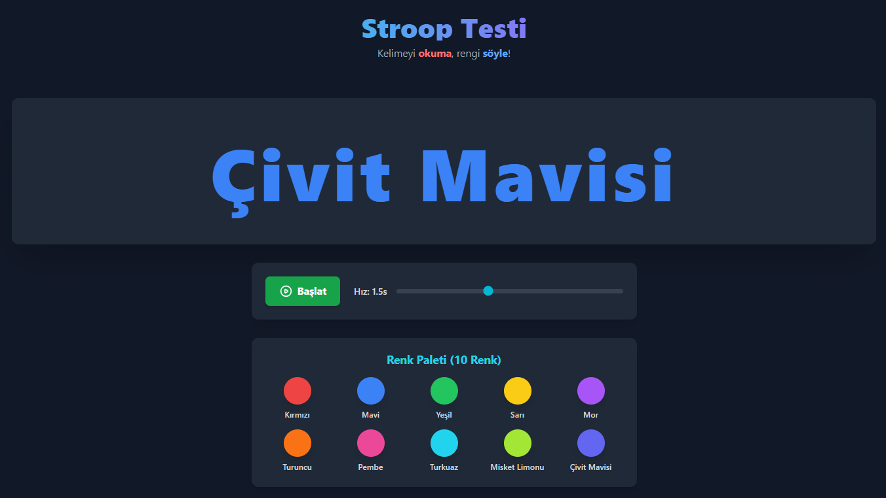

# 🧠 Stroop Testi Uygulaması




**Kelimeyi okuma, rengi söyle!**

Bu uygulama, renk adları ile bu adların yazıldığı mürekkep rengi arasındaki çelişkiyi kullanarak **Stroop Etkisi**'ni deneyimlemenizi sağlar. Stroop Etkisi, bilişsel esnekliği ve seçici dikkati ölçmek için kullanılan klasik bir psikolojik testtir.

## 🧐 Stroop Etkisi Nedir?

Stroop etkisi, bir kelimenin anlamı ("Kırmızı") ile kelimenin yazıldığı rengin (mavi mürekkep) birbiriyle çelişmesi durumunda okuma hızının yavaşlaması ve hata yapma olasılığının artmasıdır. Beynimiz kelimeyi okumaya otomatik olarak daha yatkındır, bu da kelimenin rengini söylemeye çalışırken bir müdahale (girişim) yaratır.

---

## ✨ Özellikler

* **Ayarlanabilir Hız:** Kullanıcı, kelimelerin ekranda kalma süresini ($1.5s$'den başlayarak) bir kaydırıcı ile ayarlayabilir.
* **Geniş Renk Paleti:** Testin zorluğunu artırmak için 10 farklı renk adı ve rengi kullanılmıştır:
    * Kırmızı, Mavi, Yeşil, Sarı, Mor
    * Turuncu, Pembe, Turkuaz, Misket Limonu, Çivit Mavisi
* **Koyu Tema Arayüz:** Dikkati yalnızca göreve odaklamak için optimize edilmiş sade ve koyu renkli tasarım.
* **Kullanıcı Kontrolü:** Testi başlatma ve durdurma/sıfırlama imkanı sunan net bir **"Başlat"** butonu.

---

## 🚀 Nasıl Çalıştırılır?

Bu projenin çalıştırılması oldukça basittir, temel HTML, CSS ve JavaScript teknolojilerini kullanır.

1.  **Projeyi Klonlayın:**
    ```bash
    git clone [https://github.com/KULLANICI_ADINIZ/REPO_ADINIZ.git](https://github.com/KULLANICI_ADINIZ/REPO_ADINIZ.git)
    cd REPO_ADINIZ
    ```

2.  **Uygulamayı Başlatın:**
    * Projenin ana dizininde bulunan `index.html` dosyasını tarayıcınızda açın (dosyaya çift tıklayarak veya tarayıcıdan "Dosya Aç" diyerek).

**Not:** Proje herhangi bir sunucu veya derleme adımı gerektirmez.

---

## 🕹️ Nasıl Kullanılır?

1.  **Hızı Ayarlayın:** Başlamadan önce, kelimelerin ekranda ne kadar kalacağını gösteren **"Hız"** kaydırıcısını ayarlayın. Daha düşük bir saniye değeri, testi daha zorlu hale getirir.
2.  **Görevinizi Hatırlayın:** Ekranda gördüğünüz kelimeyi **ASLA OKUMAYIN!** Sadece kelimenin yazıldığı **MÜREKKEP RENGİNİ** söyleyin.
    > ⚠️ **Örnek:** Ekranda `YEŞİL` yazısı Kırmızı renkte görünüyorsa, doğru cevap **KIRMIZI** olmalıdır.
3.  **Başlatın:** Hazır olduğunuzda **"Başlat"** butonuna tıklayın ve kelimeler gelmeye başladıkça rengi yüksek sesle söyleyin.

---

## 🤝 Katkıda Bulunma

Geri bildirimleriniz ve projenin geliştirilmesine yönelik her türlü katkı (hata düzeltmeleri, yeni özellikler, dil seçenekleri) memnuniyetle karşılanır!

1.  Bu depoyu forklayın.
2.  Yeni bir özellik dalı oluşturun (`git checkout -b ozellik/yeni-istatistikler`).
3.  Değişikliklerinizi yapın ve kaydedin (`git commit -m 'Yeni istatistik takip paneli eklendi'`).
4.  Dalı push edin (`git push origin ozellik/yeni-istatistikler`).
5.  Bir **Pull Request** açın.

---

## 📜 Lisans

Bu proje **[MIT Lisansı](LICENSE)** ile lisanslanmıştır. Daha fazla bilgi için `LICENSE` dosyasına bakınız.
